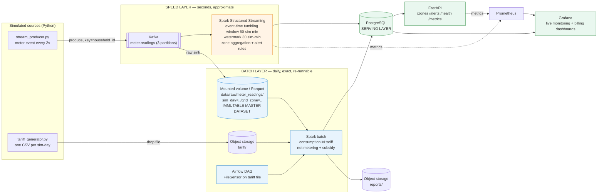
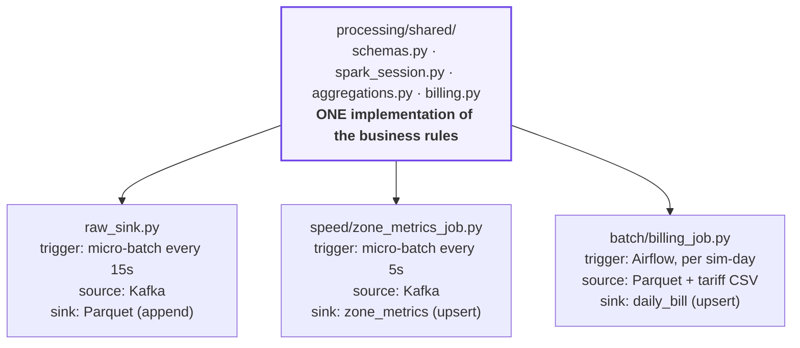

# Architecture diagrams

## 1. System architecture (Lambda)

**Pipeline stages:** generate → ingest (Kafka + file drop) → process (stream + daily batch)
→ store (Parquet master + Postgres serving) → analyse (windowed metrics + billing
reconciliation) → serve (API + Grafana) → observe (Prometheus/Grafana + JSON logs).

## 2. Where the two layers diverge — and where they don't

> Named `shared`, not `common`: `spark-submit` puts the submitted script's own
> directory first on `sys.path`, so a `processing/common/` package would shadow
> the project's top-level `common/` and every job would fail to import its config.

This is the concrete answer to Lambda's standard criticism. The duplicated part
is only the **trigger and the sink** — which *should* differ between a
low-latency approximate path and an exact daily recompute. The
transformation logic itself is imported, not re-implemented.

## 3. Simulated clock mapping

One simulated day is compressed into 5 real minutes, a factor of **288×**.

| Event | Real time | Simulated time |
|---|---|---|
| Producer starts | 0 s | 00:00 |
| Each meter emits | every 2 s | every 9.6 min |
| One speed-layer window closes | every 12.5 s | every 60 min |
| Sim-day boundary: tariff file drops, billing DAG fires | every 300 s | every 24 h |

The 9.6-simulated-minute reading gap is why the window is 60 simulated minutes
rather than 1: a 1-minute window would be narrower than the gap between two
readings and would mostly be empty. At 60 minutes each window holds
60 / 9.6 ≈ 6 readings per meter — enough to be a genuine aggregate.
